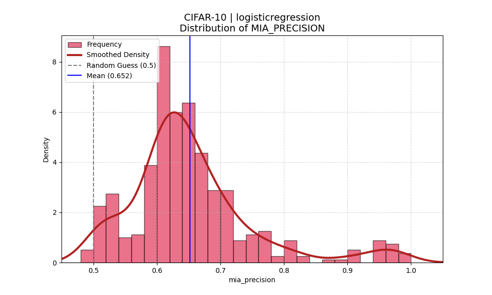
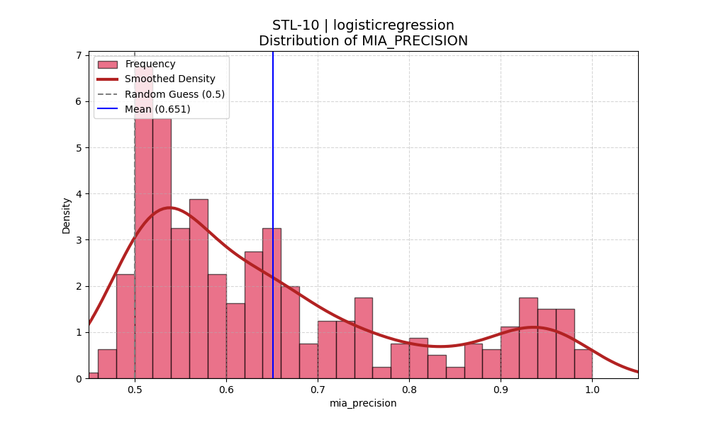
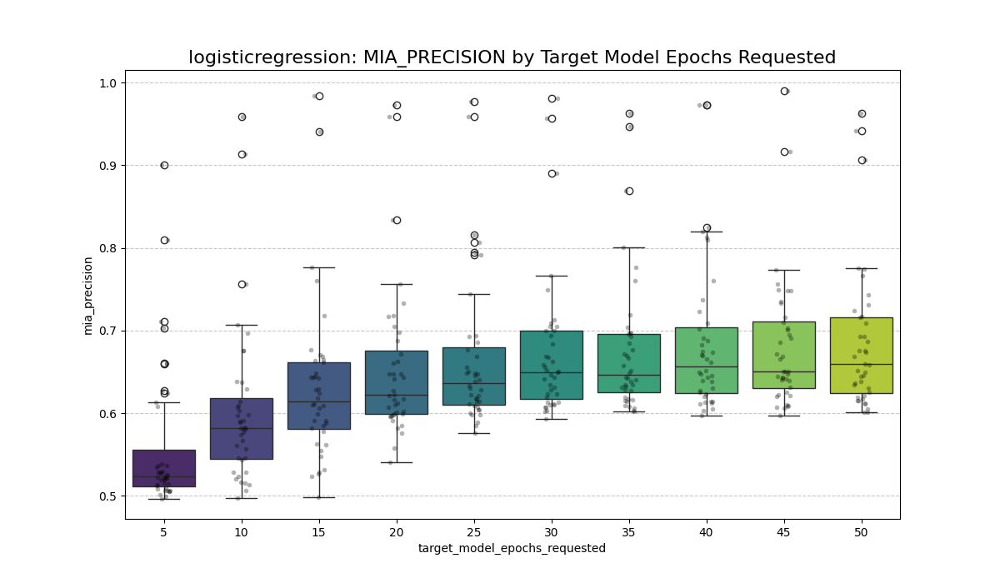
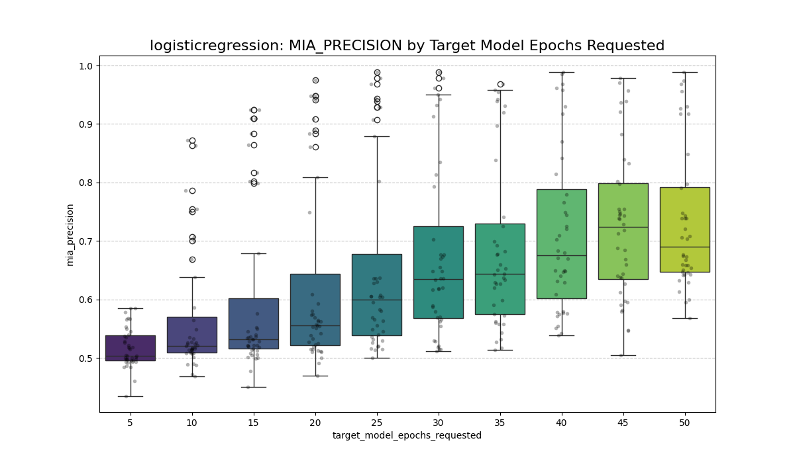
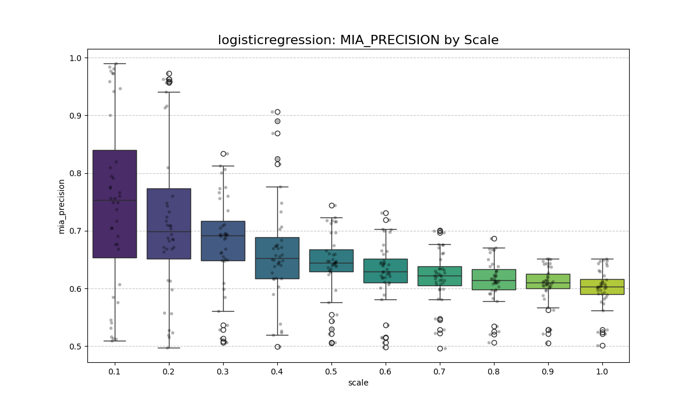
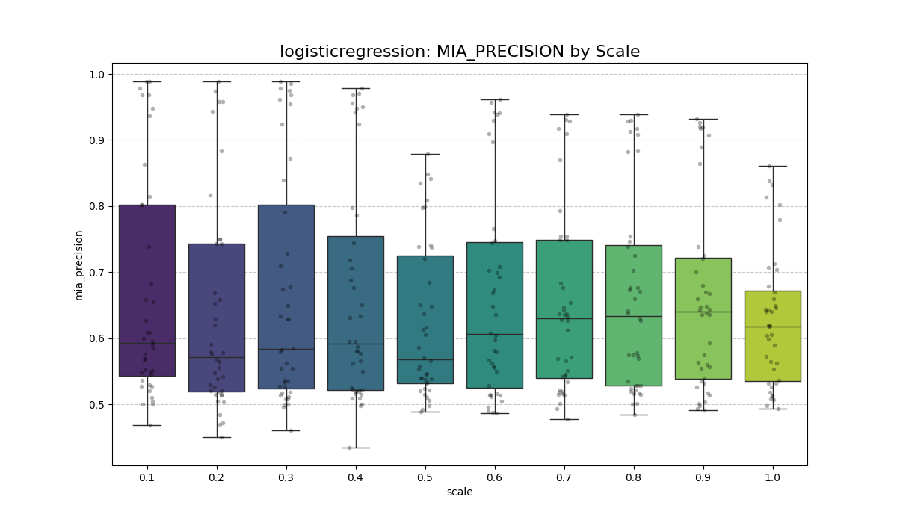
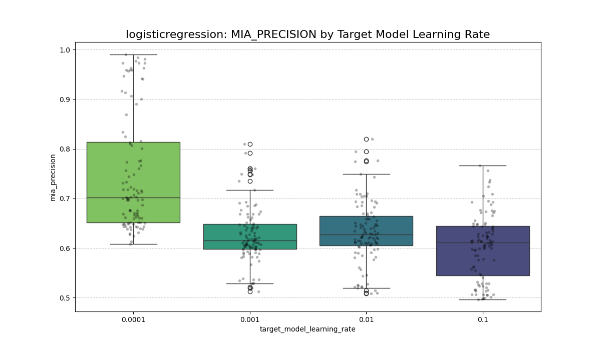
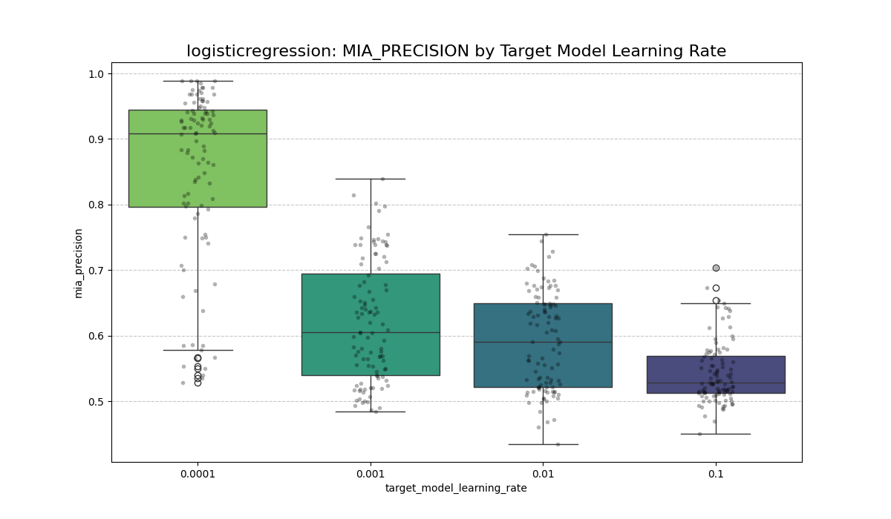

# Project Title (e.g., Membership Inference Attack on CIFAR-10)

## Overview
This projects investigates the impact of hyperparameters on Model leakage (Membership Inference).
A key focus of this research is understanding how training dynamics, especially the interaction between learning rate (LR), scale (SC) and number of epochs (NE), influence the privacy risk of a ResNet18 model.

$LR = [0.1, 0.01, 0.001, 0.0001]$

$SC = [0.1, 0.2, 0.3, 0.4, 0.5, 0.6, 0.7, 0.8,0.9, 1.0]$

$NE = [5, 10, 15, 20, 25, 30, 35, 40, 45, 50]$


The resulting search space of hyperparameter holds a total of $|LR| \times |SC| \times |NE| = 400$ hyperparameter combinations.

## Project Structure


``` 
.
├── artifacts/              # Configs and experiment results (.jsonl)
├── plots/                  # Generated visualizations (Categorized by Dataset/Metric)
├── scripts/                # Entry-point scripts (main, visualize, etc.)
├── src/                    # Core logic and model definitions
```

## Setup and Installation
```
pip install requirements.txt
```


## Usage
### 1. Generate Hyperparameter configs
```
python generate_configs.py
```

### 2. Run Config Training
```
python main.py
```

### 3. Visualize Results
```
python visualize.py
```

###


## Results
The evaluation on CIFAR-10 and STL-10 using a ResNet18 architecture demonstrates that model leakage is highly sensitive to hyperparameter configuration. Membership Inference Attack (MIA) precision scores ranged from 0.422 to 1.00, indicating a spectrum of privacy risk from baseline (random guess) to complete training data exposure.

### Global Distribution of Training Data Leakage

| CIFAR-10  | STL-10 |
| ------------- | ------------- |
|  |   |

### Hyperparameter Impact

| Impact Category |CIFAR-10  | STL-10 |
| ------------- | ------------- | ------------- |
| Epochs |   |   |
| Scale |   |   |
| Learning Rate |  |   |


