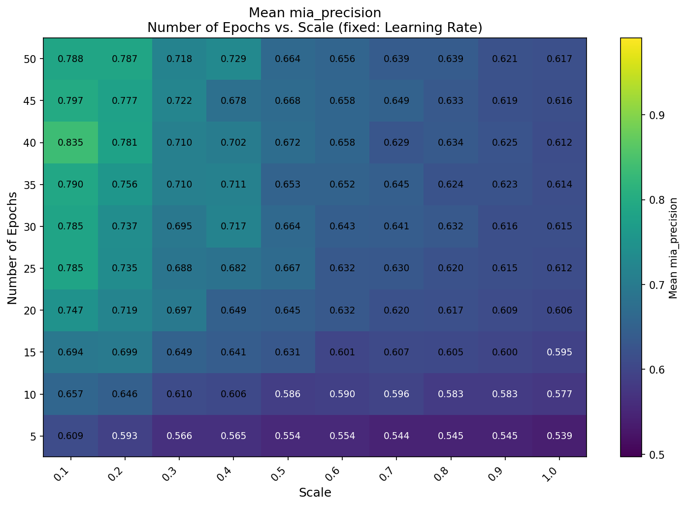
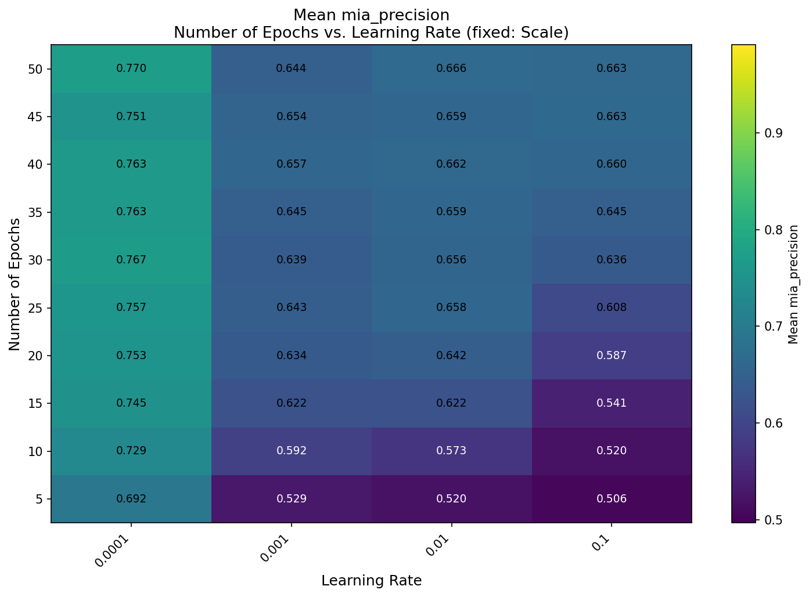
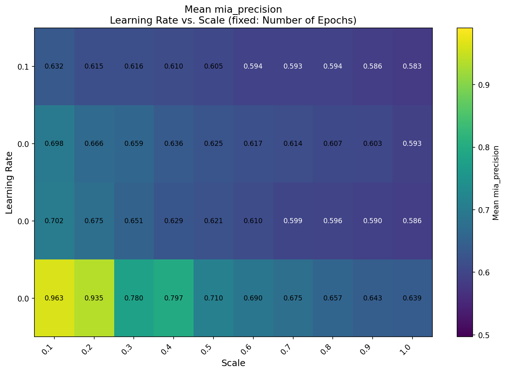

# Membership Inference Attack — Hyperparameter Sensitivity Analysis

## Overview
This project investigates how hyperparameter configurations influence membership leakage
in a ResNet18 model trained on CIFAR-10. Training dynamics — specifically the interaction
between learning rate (LR), dataset scale (SC), and number of epochs (NE) — are treated
as forensic indicators of privacy risk.

The search space covers 400 unique configurations:

$LR = [0.1, 0.01, 0.001, 0.0001]$

$SC = [0.1, 0.2, ..., 1.0]$

$NE = [5, 10, ..., 50]$

$|LR| \times |SC| \times |NE| = 400$

## Project Structure
```
.
├── artifacts/              # Configs and experiment results (.jsonl)
├── plots/                  # Generated visualizations (categorized by dataset/metric)
├── scripts/                # Entry-point scripts (main, visualize, etc.)
├── src/                    # Core logic and model definitions
```

## Setup
```
pip install -r requirements.txt
```

## Usage
### 1. Generate hyperparameter configs
```
python generate_configs.py
```
### 2. Run training
```
python main.py
```
### 3. Visualize results
```
python visualize.py
```

## Key Findings

MIA Precision scores ranged from **0.422** (baseline, random guess) to **1.00** (complete
training data exposure), demonstrating that hyperparameter selection alone can determine
whether a model is effectively private or fully vulnerable.

### Global Distribution


The majority of configurations cluster around a mean precision of 0.65, but a distinct
long tail extends toward 1.0, representing high-risk configurations.

### Impact of Individual Hyperparameters

| Learning Rate | Scale | Epochs |
|---|---|---|
|  |  |  |

- **Lower learning rates** produce higher mean precision and a larger IQR, suggesting deeper memorization during fine-grained convergence.
- **Smaller dataset scales** result in higher leakage and broader distributions; larger datasets stabilize precision toward baseline.
- **More epochs** increase mean precision, with the most significant gains between 5 and 20 epochs. Beyond 20, further training yields diminishing returns.

### Hyperparameter Interactions

| Fixed: Learning Rate | Fixed: Scale | Fixed: Epochs |
|---|---|---|
|  |  |  |

The most critical leakage zone occurs at the intersection of the lowest learning rate
(0.0001) and minimum dataset scale (0.1), yielding a mean precision of **0.9632** — a
near-total collapse of privacy driven by memorization over generalization.